# cssHolmes Tutorial — XTF Themes and XMF Widgets

**Audience:** XOOPS designers, theme builders, theme editors, widget developers
**Requires:** XOOPS 2.5.12+, cssHolmes installed and activated
**Status:** matches the current implementation as of 2026-03-26

---

## What You Can Do With cssHolmes

cssHolmes is a diagnostic and editing workbench built into XOOPS. It helps
with three jobs:

1. **Creating** a new XTF theme
2. **Editing** or repairing an existing theme
3. **Building** and validating new XMF Widgets

It works on both the public site and the admin side, which matters because
XTF widgets and layout patterns live in both places.

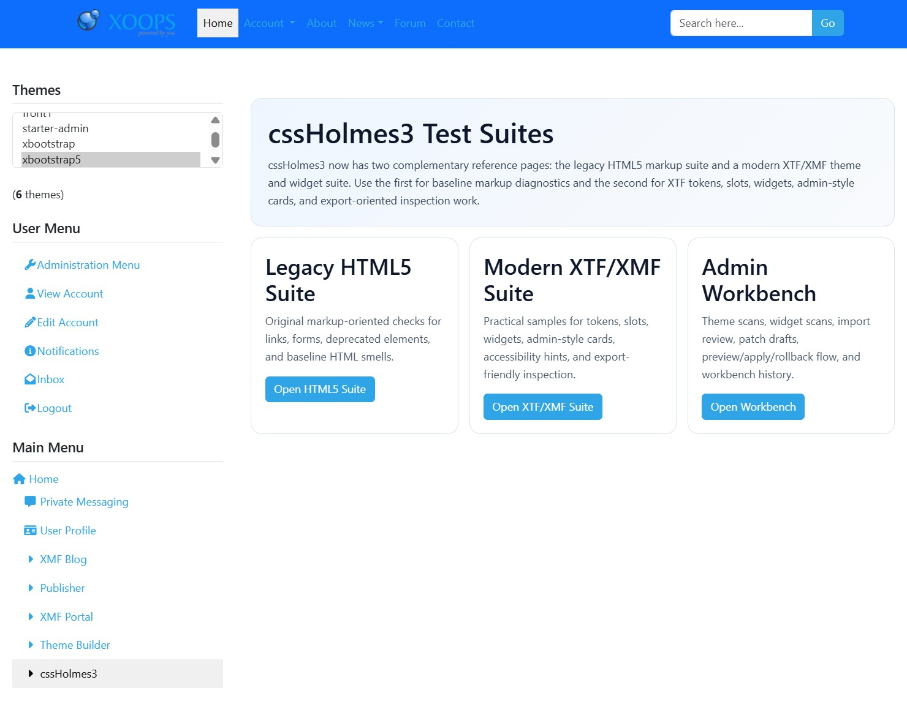

*The hub page gives you three paths: the legacy HTML5 test suite for generic
markup checks, the modern XTF/XMF test suite for theme and widget work, and
the admin workbench for server-side scans and exports.*

### What about sites without XTF?

If no `theme.json` manifest is detected, cssHolmes switches to generic mode.
HTML5, accessibility, layout, inspection, measurement, copy, and export still
work. Only the XTF-specific tools (token matching, slot jumping, theme
scanning) stay disabled.

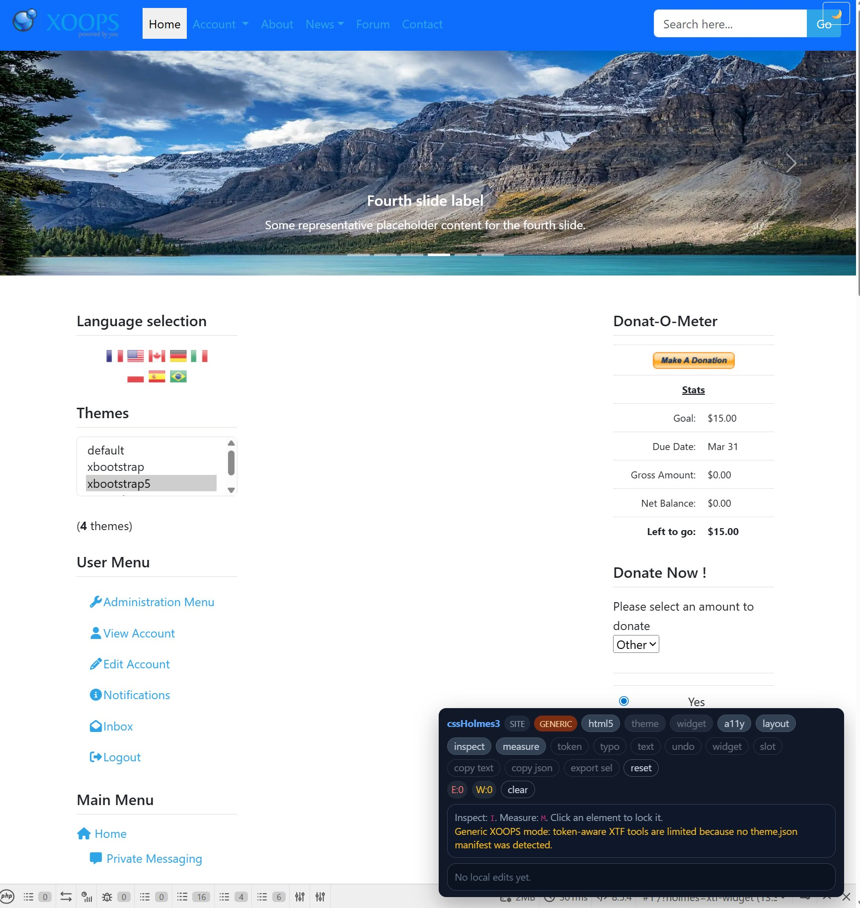

*On a plain XOOPS install, the toolbar shows the available tools and explains
why XTF features are limited. You can still use it for HTML quality and
accessibility work.*

---

## XTF in 60 Seconds

If you are new to XTF, here is the minimum you need to understand before
using cssHolmes.

**Theme = a directory with a `theme.json` file.** That file declares the
theme's name, version, assets, and structure. It replaces the old approach
of loose PHP files and CSS with no machine-readable manifest.

**Slots = named regions in a theme layout.** A theme declares slots like
`header`, `sidebar`, `content`, `footer`. Each slot is a place where widgets
can be placed. Think of slots as containers with names.

**Widgets = reusable components.** A widget produces HTML that gets rendered
inside a slot. Widgets have names (like `xmf:hero`, `xmf:testimonial`),
properties, and variants. They follow the `.xmf-` CSS class convention.

**Tokens = design variables.** A theme declares tokens in `theme.json` for
colors, spacing, fonts, and radii. They become CSS custom properties like
`--xtf-color-primary`. Using tokens instead of hardcoded values means
changing one token updates the entire theme.

**The relationship:**

```
theme.json
  declares slots ─── each slot holds widgets
  declares tokens ── used in CSS as var(--xtf-*)
  declares assets ── CSS and JS files
```

When cssHolmes inspects an element, it can tell you which slot it belongs to,
which widget rendered it, and which token (if any) controls its color. That
is the information browser devtools cannot provide.

---

## Before and After

The fastest way to understand what cssHolmes does is to see the same page
with and without it.

**Without cssHolmes** — a normal XOOPS page:

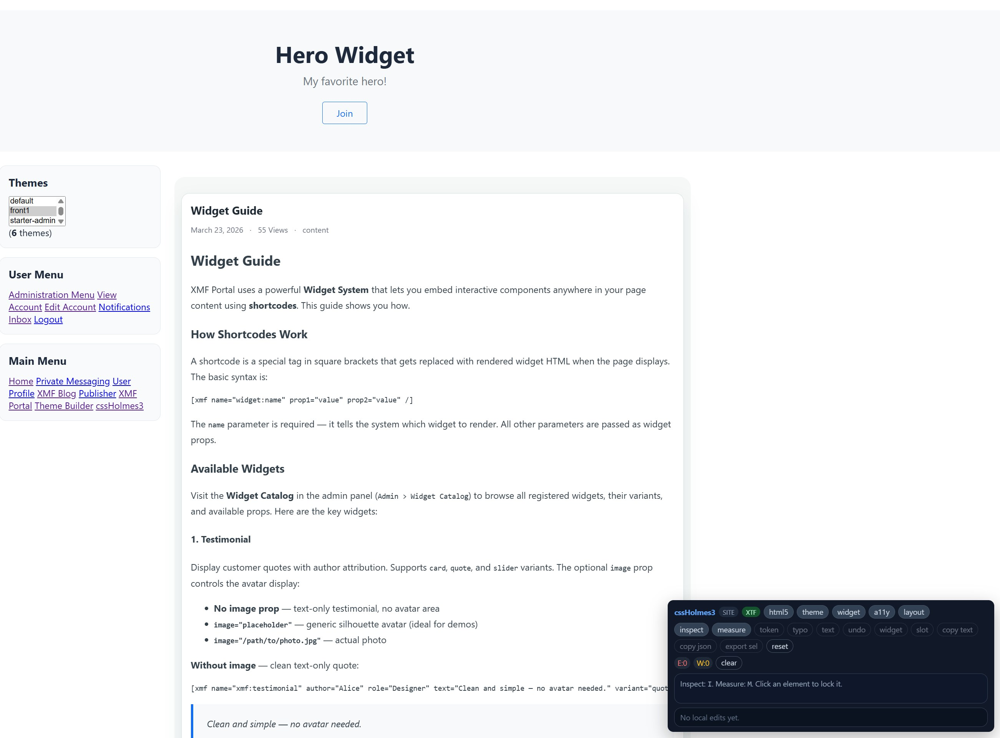

*Nothing visible. The page renders normally. You cannot tell which elements
are widgets, where slot boundaries are, or whether colors use tokens.*

**With cssHolmes activated** — same page, `?holmes=xtf-theme,widget,layout`:

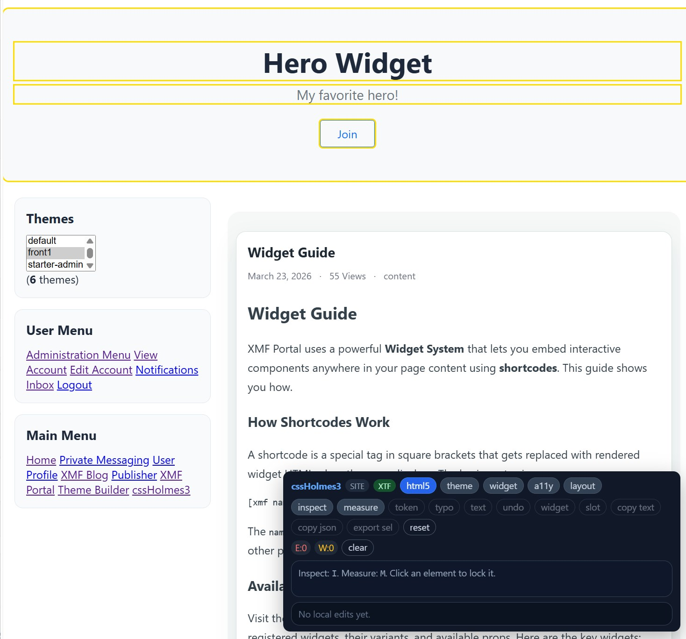

*Now you can see the toolbar at the bottom, the active profiles highlighted
in the profile row, and the diagnostic status. The page is annotated without
being broken.*

**With the layout profile active** — outlines show structure:

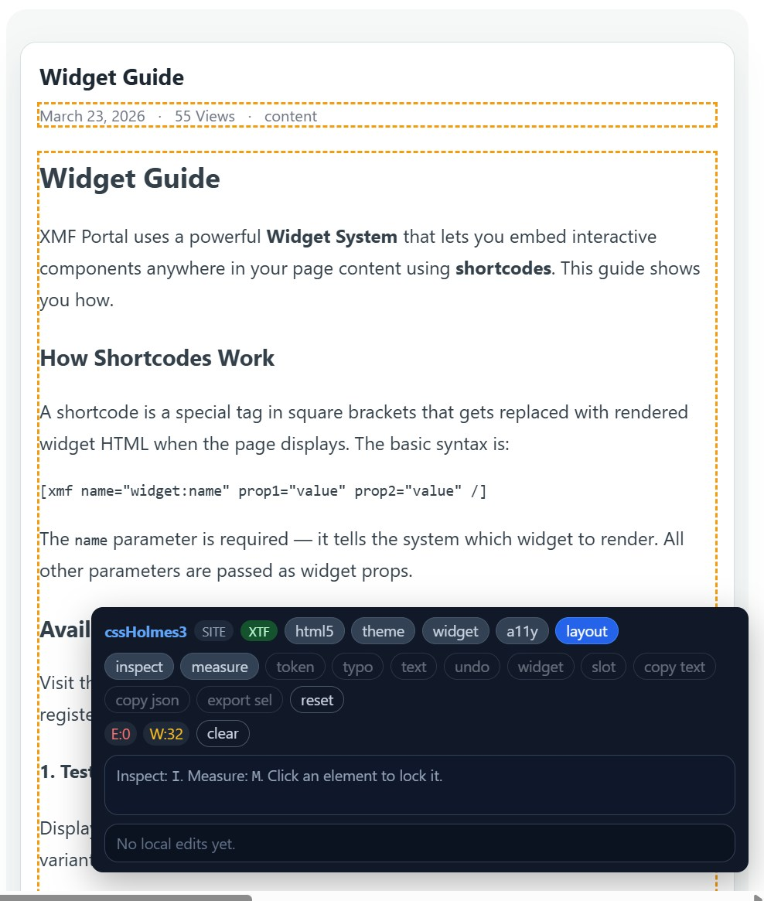

*The layout profile adds dashed outlines to containers so you can see nesting
depth, empty blocks, and spacing at a glance. Useful for catching alignment
drift in slot shells and widget wrappers.*

---

## Core Concepts

### 1. Overlay Profiles

Profiles are layers of diagnostic CSS. Each one highlights a different
category of issues. You combine them for the job at hand.

| Profile | What it highlights |
|---------|-------------------|
| `html5` | Missing attributes, deprecated elements, empty blocks |
| `xtf-theme` | Hardcoded colors, empty slots, dark mode breakage |
| `xtf-widget` | Widget root classes, SVG dimensions, inline handlers |
| `a11y` | Landmarks, labels, empty links/buttons, tabindex |
| `layout` | Nesting depth, empty containers, layout shift risks |

Activate with a query parameter:

```
/?holmes=xtf-theme,xtf-widget
/?holmes=all
/modules/cssholmes/admin/index.php?holmes=xtf-theme,a11y
```

Use them as layers, not all-or-nothing. For theme work, start with
`xtf-theme,a11y,layout`. For widget work, use `xtf-widget,layout,html5`.

### 2. Reading the Diagnostic Counts

The toolbar shows error and warning counts:

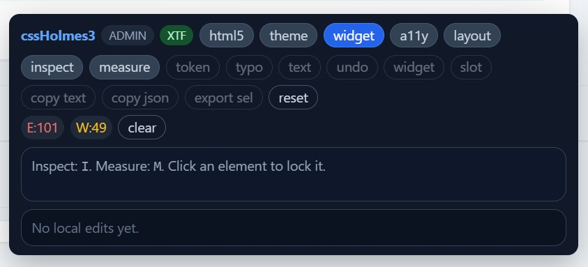

| Indicator | Color | Meaning |
|-----------|-------|---------|
| **E:** (red) | Red outline on page | Error — broken, invalid, or missing required attribute |
| **W:** (orange/yellow) | Orange/yellow outline | Warning — likely problem or bad practice |

The counts sum all visible diagnostic outlines on the current page across all
active profiles. Click `clear` to dismiss them.

### 3. The Toolbar

The toolbar is your working surface. It groups into three tiers:

**Navigate and understand:**
- `inspect` — hover to see element details, click to lock selection
- `measure` — show pixel distances between elements
- `widget` — jump from any child to the nearest widget wrapper
- `slot` — jump to the nearest slot wrapper

**Edit and experiment:**
- `token` — preview color changes with token matching
- `typo` — adjust font size, weight, line-height, alignment
- `text` — make text content editable for quick experiments

**Capture and share:**
- `copy text` — copy the selected element's text content
- `copy json` — copy the inspection snapshot as JSON
- `export sel` — export the full inspection with context
- `undo` — revert the last local edit

Keyboard shortcuts: `I` inspect, `M` measure, `T` token, `P` typography,
`U` undo, `Esc` clear selection.

### 4. The Admin Workbench

The admin side is where inspection results become actual work.

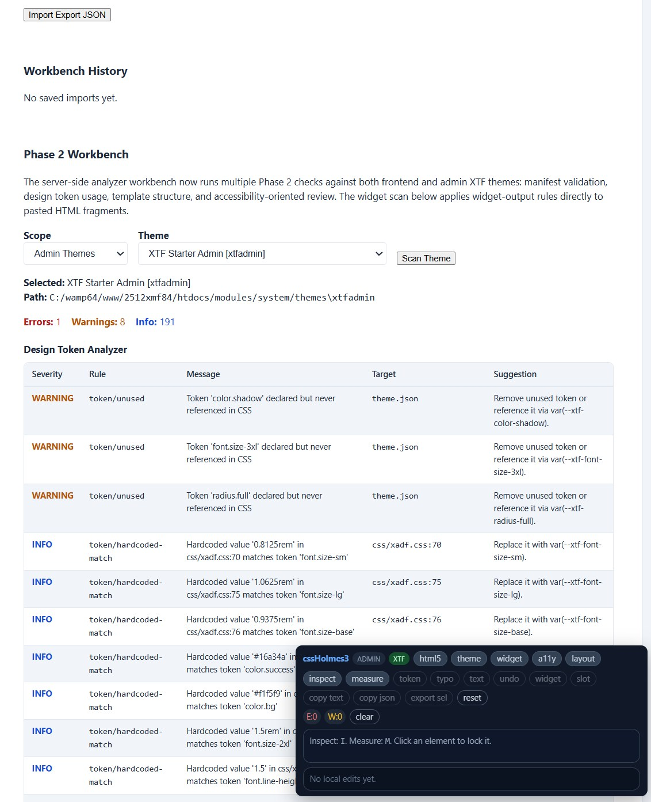

The workbench workflow:

1. **Theme scan** — select a theme, run analyzers, review findings by category
2. **Export/Import** — paste JSON from toolbar inspections into the workbench
3. **Review** — accept or reject individual changes
4. **Patch draft** — generate suggested edits with likely file targets
5. **History** — compare scans over time to track regressions

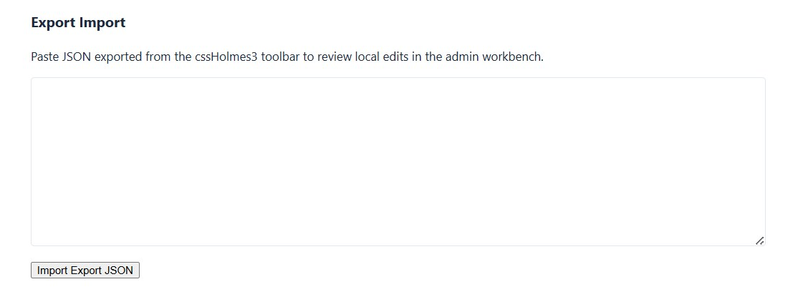

*Paste toolbar JSON here to convert live experiments into structured review
items. The workbench adds file targets and patch suggestions.*

---

## Quick Start for Designers

This is the simplest useful workflow for designing or refining a theme.

### Step 1. Open any page with cssHolmes

Add the query parameter to the URL:

```
/?holmes=xtf-theme,a11y,layout
```

For widget-heavy pages:

```
/?holmes=xtf-theme,xtf-widget,layout
```

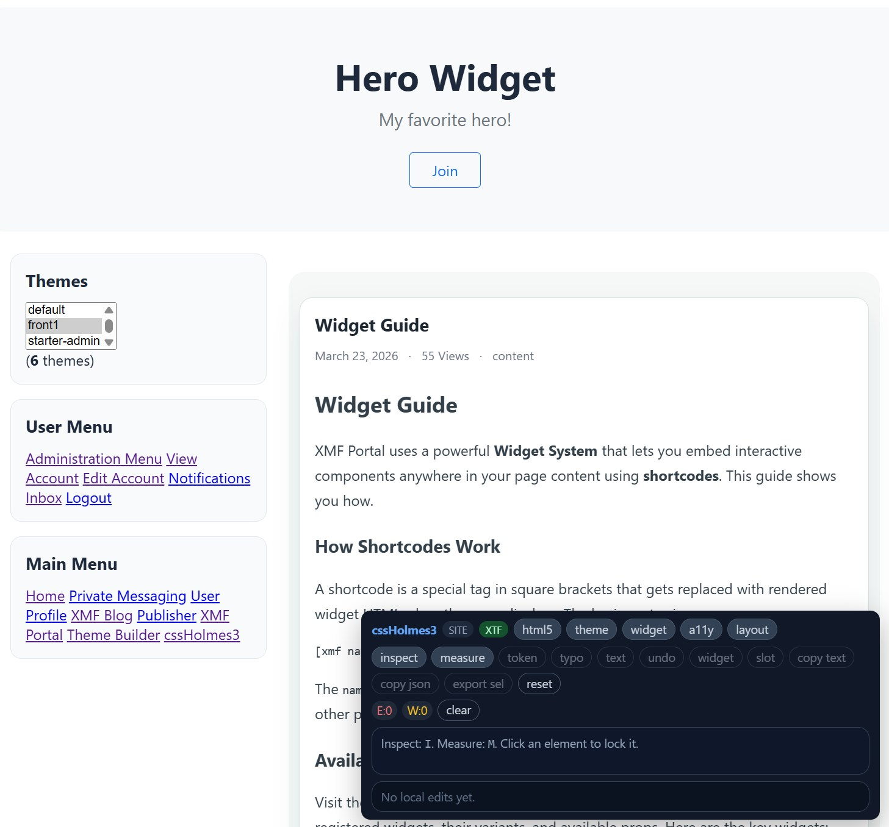

*Start with a realistic page — one with widgets, sidebar, and content — because
it exercises the theme shell, widget output, and slot structure at the same time.*

### Step 2. Inspect an element

Click `inspect` in the toolbar (or press `I`), then hover any element. The
toolbar shows live metrics: selector, size, position, margins, padding, font,
color, theme, and — when applicable — the nearest widget and slot.

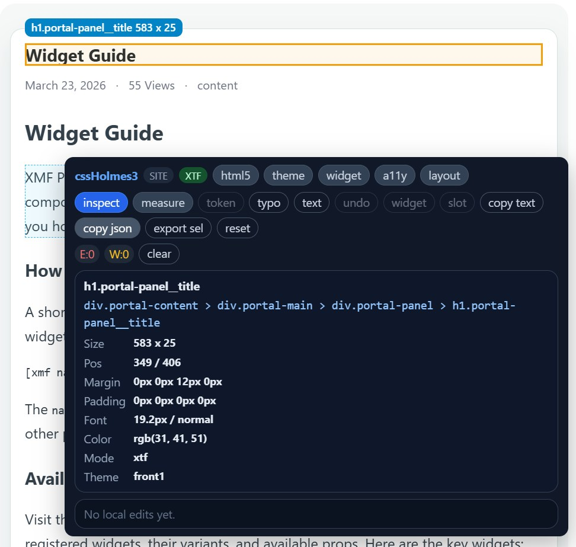

*Click to lock the selection. The inspector panel shows everything you need
to know: the full selector path, actual computed values, which theme is active,
and the XTF mode.*

Click a deeper element to see its specific properties:

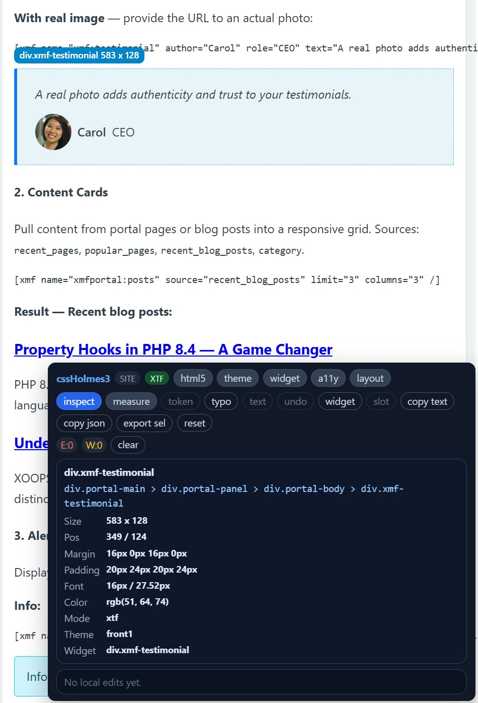

*Here the inspector shows the `div.xmf-testimonial` widget boundary, its slot
context, and all computed styles. The Widget line tells you this is inside a
recognized XMF widget.*

### Step 3. Jump to the widget or slot boundary

If you clicked a nested child — a paragraph, an icon, a span — the `widget`
button jumps to the nearest `.xmf-*` widget wrapper. The `slot` button jumps
to the nearest slot wrapper.

This is the most useful XTF-specific improvement over browser devtools. It
answers: "Am I editing the theme shell, the slot wrapper, or the widget itself?"

### Step 4. Try a local edit

Use:
- `token` for color/token previews
- `typo` for font size, line-height, weight, alignment, spacing
- `text` for quick content experiments on leaf text nodes

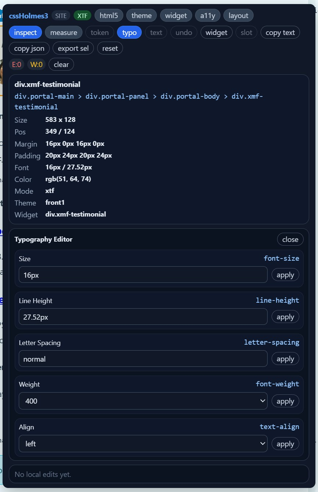

*The typography editor lets you tune font size, line-height, weight, spacing,
and alignment before touching any CSS file. Especially useful for density
tuning in admin tables and widget cards.*

These are local preview edits, not file writes. That is deliberate — the page
stays safe while you experiment.

### Step 5. Measure spacing

Click `measure` (or press `M`), then select an element and hover another.
cssHolmes draws measurement lines between them showing pixel distances.

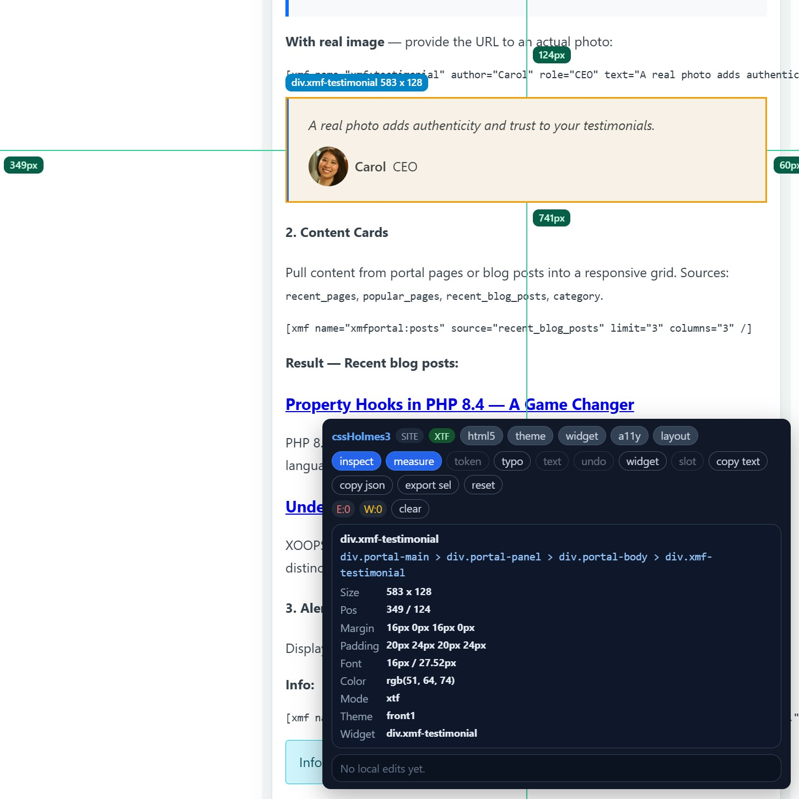

*Measure mode answers layout questions that are hard to judge by eye: spacing
between cards, gaps inside slot shells, padding symmetry in admin panels.*

### Step 6. Export the result

When you find a useful change:

- `copy json` copies the current inspection snapshot
- `export sel` exports the full context with selector, metrics, widget, slot,
  and theme information

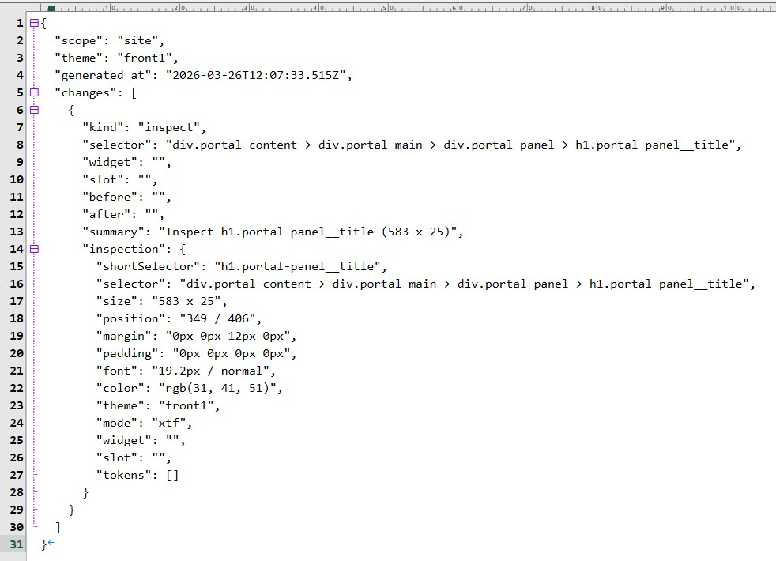

*The exported JSON keeps everything together: selector path, computed values,
theme name, widget name, slot name, and matched tokens. Paste this into the
admin workbench for structured review.*

### Step 7. Review in the workbench

Paste the exported JSON into the admin workbench. It converts your experiments
into:

1. structured review items with likely target files
2. patch drafts showing what to change and where
3. a shared record that designers and developers can both read

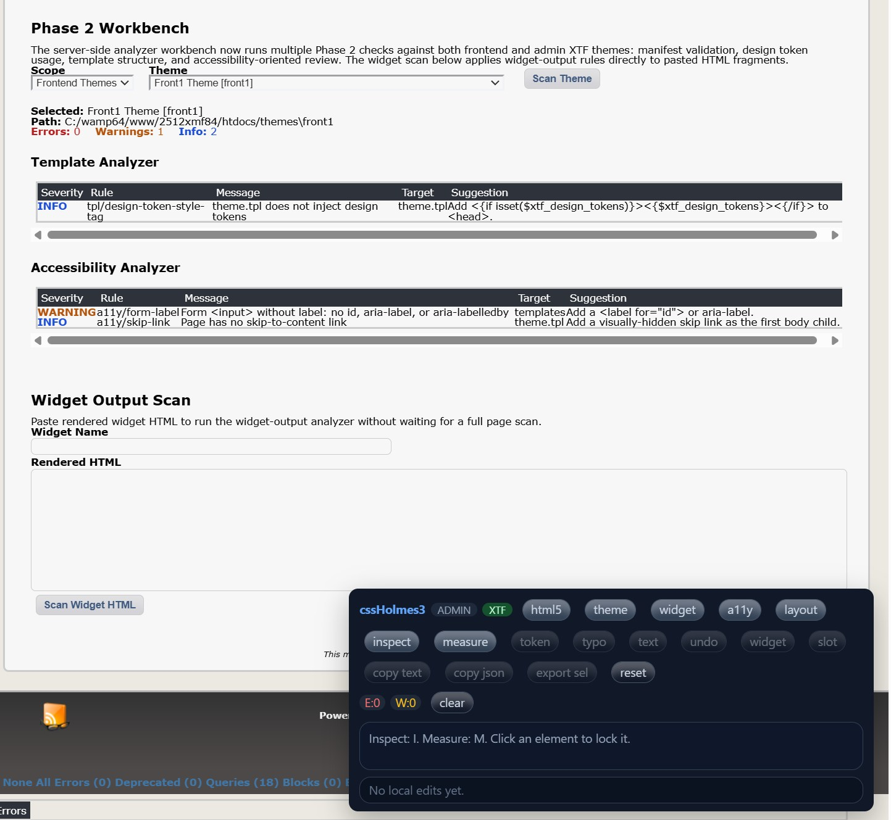

*The server-side scan complements the live overlay. Manifest errors, missing
tokens, template problems, and accessibility findings become structured
review rows.*

---

## Quick Start for Developers

### Theme build workflow

1. Build or scaffold the XTF theme.
2. Open the site with `?holmes=xtf-theme,layout,a11y`.
3. Use `inspect`, `measure`, `widget`, and `slot` to verify rendered structure.
4. Go to the admin workbench and run a theme scan.
5. Review findings by analyzer: manifest, tokens, templates, accessibility.
6. Use toolbar exports and workbench drafts to convert experiments into code.

### Widget build workflow

1. Render the widget in a realistic page or slot.
2. Use `?holmes=xtf-widget,layout` overlay profiles.
3. Inspect the root wrapper — confirm it has an `xmf-` prefixed class.
4. Use `widget` to jump to the wrapper that should remain stable.
5. Export inspection or local edits for follow-up.
6. In the workbench, paste raw widget HTML into the widget scan card.
7. Review widget-output findings before shipping.

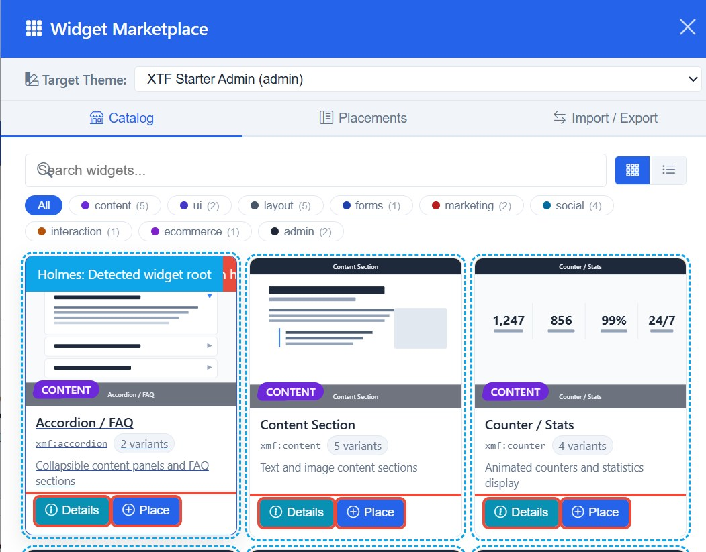

*The marketplace catalog is a useful real-world test target: cssHolmes can
inspect actual widget cards rendered inside slot wrappers.*

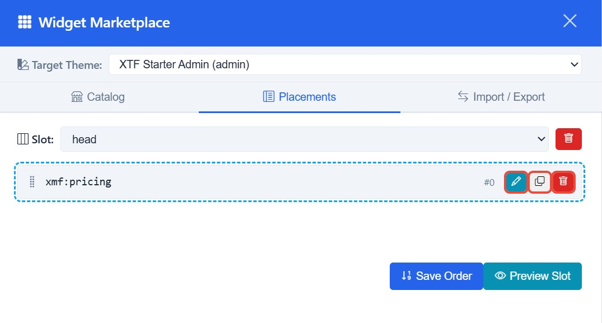

*Slot-aware views matter because many XTF problems are not inside the widget
template itself, but in how the widget is placed, ordered, or reused across
slots.*

### Admin theme workflow

cssHolmes runs on admin pages too. Use it for:

- admin list views and table density
- dashboard widget spacing
- toolbar and header alignment
- card layouts and icon presentation
- accessibility checks in admin interactions

Admin themes are where spacing drift, hardcoded colors, and typography
inconsistencies accumulate fastest.

---

## Walkthrough: "What Is This Color?"

This is the #1 use case when inheriting an existing theme. You see a color
on the page and need to know: is it backed by a token? Which one? Should I
change `theme.json` or component CSS?

1. Activate `?holmes=xtf-theme` on the page.

2. Click `inspect`, then click the colored element.

3. Look at the **Color** line in the inspector. If a token matches, you will
   see it listed in the token field.

4. If the color says `rgb(37, 99, 235)` and the token line shows
   `--xtf-color-primary`, that means the value comes from the
   `color.primary` token in `theme.json`. To change it globally, edit the
   token — not this element's CSS.

5. If no token is shown, the color is hardcoded. The `xtf-theme` profile
   will outline it as a warning. Consider adding a token for it.

6. Use the `token` editor to preview a replacement. If you pick a color that
   matches an existing token, cssHolmes suggests the token reference instead
   of a raw hex value.

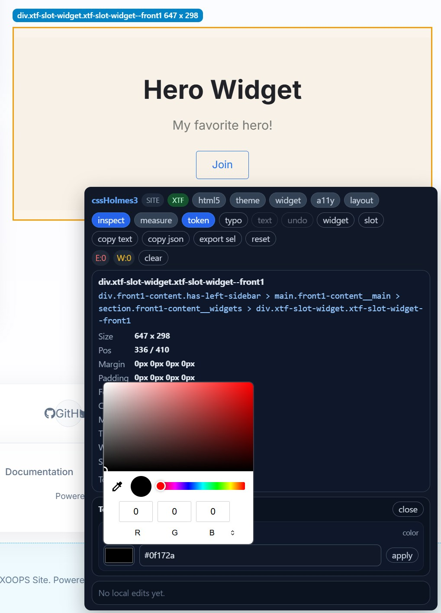

*The token editor shows the current color, a native color picker for
previewing changes, the matched token key, and an apply button. The hex
value at the bottom tells you exactly what is in `theme.json`.*

---

## Walkthrough: Inspecting an Element Step by Step

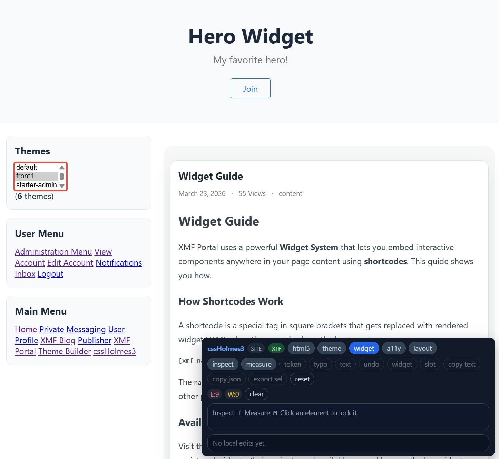

*Starting point. The toolbar is visible, inspect mode is ready, no element
is selected yet.*

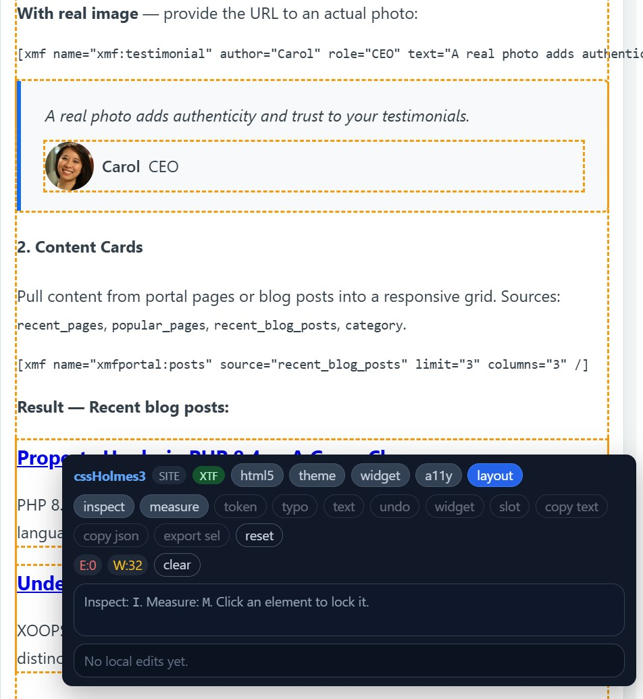

*Hover any element. The inspector shows live metrics in the toolbar panel:
selector path, dimensions, computed styles. Nothing is locked yet — move the
mouse to explore different elements.*


*Click to lock. The element is now selected. You can read its full details,
use widget/slot jumps, or open editors. The selection stays locked until you
click elsewhere or press Esc.*

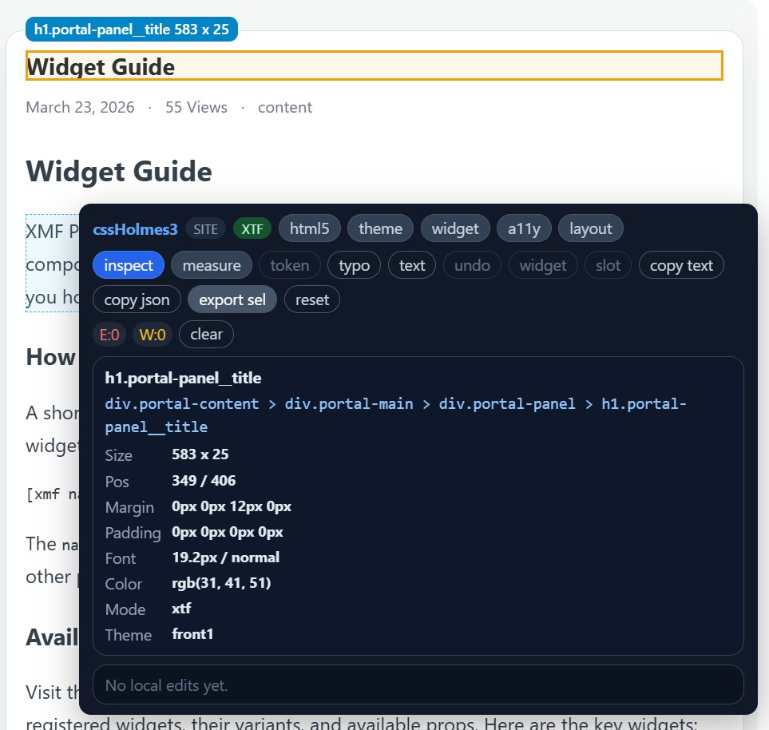

*With the element locked, `copy text` copies its text content and `copy json`
copies the full inspection snapshot. Both are one-click operations.*

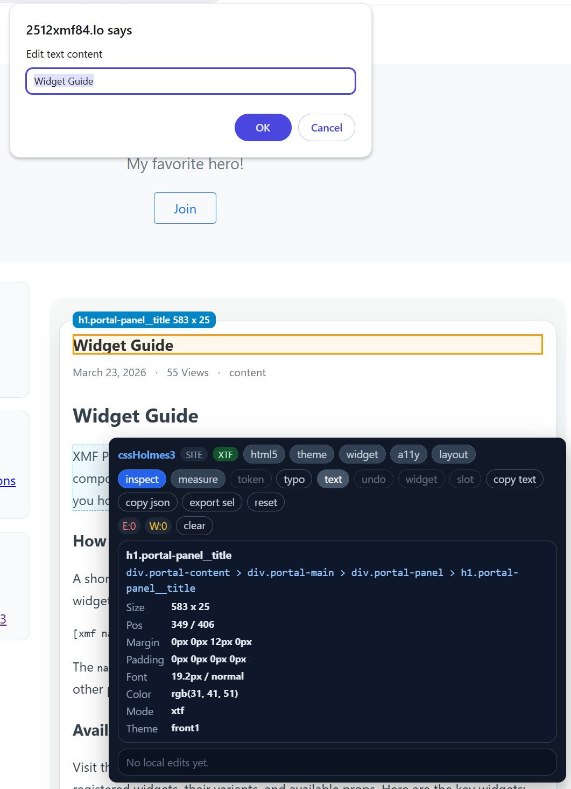

*The `text` tool opens a prompt to edit the element's text content directly.
This is for quick content experiments — the change is local and undoable.*

---

## When cssHolmes Becomes Indispensable

### You inherit a theme with inconsistent colors

1. `inspect` shows each element's color
2. Token matching shows which colors map to `theme.json` tokens
3. `token` editor lets you preview a change safely
4. Export + workbench creates a patch draft for `theme.json`

Without this, the work is guesswork across CSS files and templates.

### A widget looks correct in one slot but broken in another

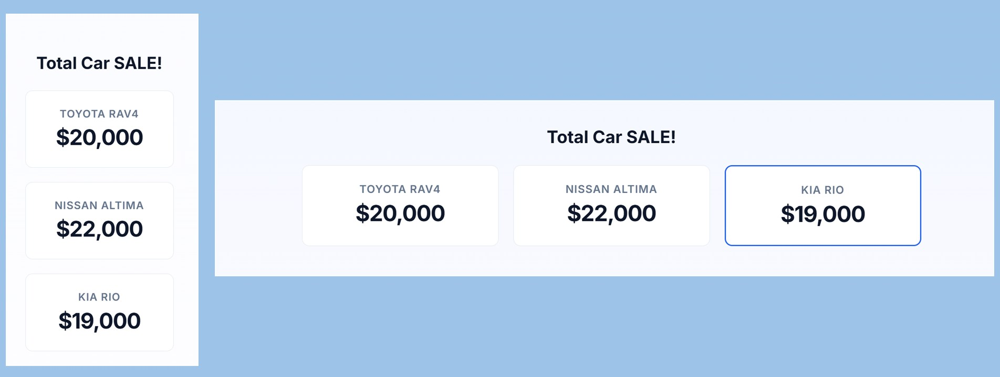

*The same pricing widget placed in two slots. In the narrow sidebar (left),
the cards stack vertically. In the wide content slot (right), they display
side-by-side as designed. cssHolmes helps you see why: `widget` shows the
wrapper, `slot` shows the container width, `measure` confirms the 280px
constraint.*

1. `widget` jumps to the widget wrapper in each context
2. `slot` shows the containing slot's constraints
3. `measure` reveals actual spacing differences between contexts
4. The widget scan validates the HTML output independently

This is exactly the kind of issue where generic devtools are not enough.

### You are building a new admin theme

1. cssHolmes runs on the admin side
2. `typo` helps tune density quickly across dense tables
3. `measure` catches awkward spacing between cards and panels
4. `a11y` profile highlights focus and structural issues
5. Export/import gives you a repeatable review loop

### A designer and developer need a shared language

The designer exports the inspected element with selector, slot, widget, token,
and metrics. The developer sees exactly what to change and where. The workbench
generates patch suggestions. No more screenshots with arrows and vague comments.

---

## Suggested Profile Combinations

| Job | Profiles |
|-----|----------|
| New XTF theme | `xtf-theme,a11y,layout` |
| Widget development | `xtf-widget,layout,html5` |
| Final QA pass | `xtf-theme,xtf-widget,a11y,layout` |
| Admin theme refinement | `xtf-theme,a11y,layout` |
| Generic markup check | `html5` |

---

## Recommended Workflow Loop

For the best results, treat cssHolmes as a loop:

1. **Scan** — run the server-side analyzers on the theme
2. **Inspect** — use the live overlay to explore flagged areas
3. **Preview** — try local changes with the token, typo, and text editors
4. **Export** — capture inspection snapshots and local edits as JSON
5. **Review** — import into the workbench, accept or reject changes
6. **Patch** — generate draft patches with file targets
7. **Rescan** — verify the fixes reduced the finding count

This loop works for XTF because the real problem is rarely just CSS. It is
usually the combination of theme manifest, token choice, template structure,
slot placement, and widget output. cssHolmes can see across all of those.

---

## Current Limitations

1. Toolbar edits are preview edits, not direct file writes.
2. Patch drafts are guidance, not automatic safe commits.
3. Token matching depends on `theme.json` values being exposed as CSS
   custom properties.
4. Widget scan works best with representative pasted HTML, not full
   registry-driven widget introspection.
5. Browser-level manual verification is still important before shipping.

These are acceptable constraints because they keep the tool safe while still
making it immediately useful.

---

## Reference: Test Suites

cssHolmes includes two test suite pages:

**Legacy HTML5 Suite** — the original holmes.css diagnostic fixtures:

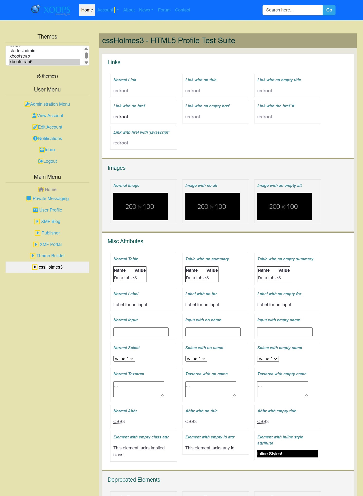

*Links, images, form attributes, deprecated elements, empty blocks — all
rendered with intentional problems so you can see what each diagnostic looks
like.*

**Modern XTF/XMF Suite** — practical samples for token-aware work:

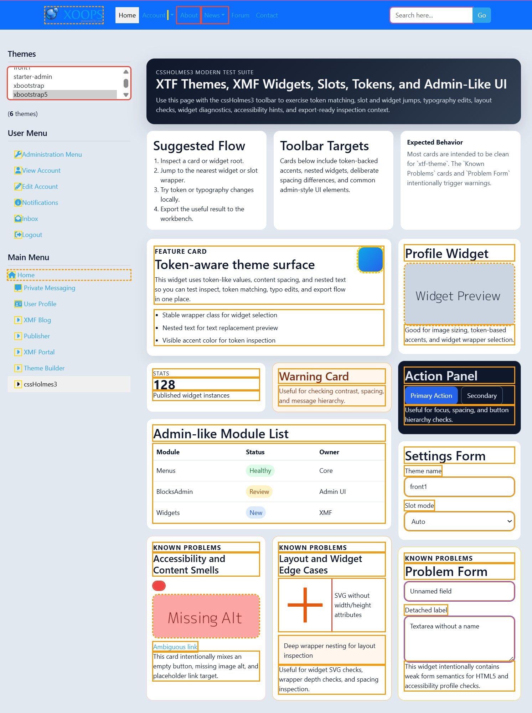

*Feature cards, widget previews, admin-like panels, warning cards, forms,
accessibility samples, and edge cases. Use this page to learn what each
profile highlights before running it on a real site.*

---

## What Comes Next

The next expansions that would strengthen this workflow:

1. Direct token patch application to `theme.json`
2. Richer widget analyzer coverage
3. Typography export mapped to likely CSS targets automatically
4. Image swap tooling for widget and card design
5. Scan history comparison across theme revisions

Even before those arrive, cssHolmes is already useful enough to become part
of the normal XOOPS XTF workflow.
